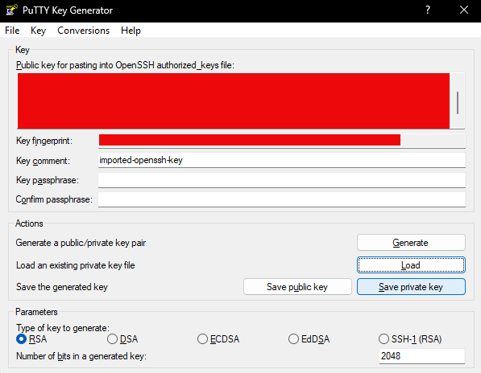
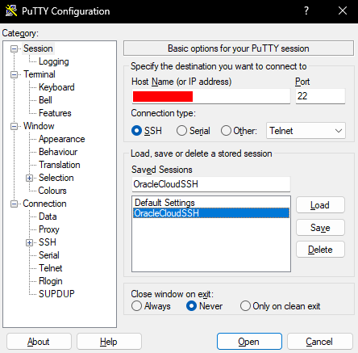
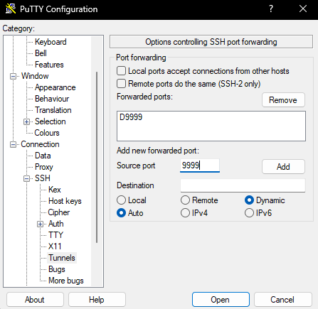
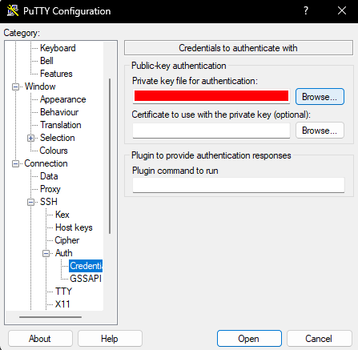
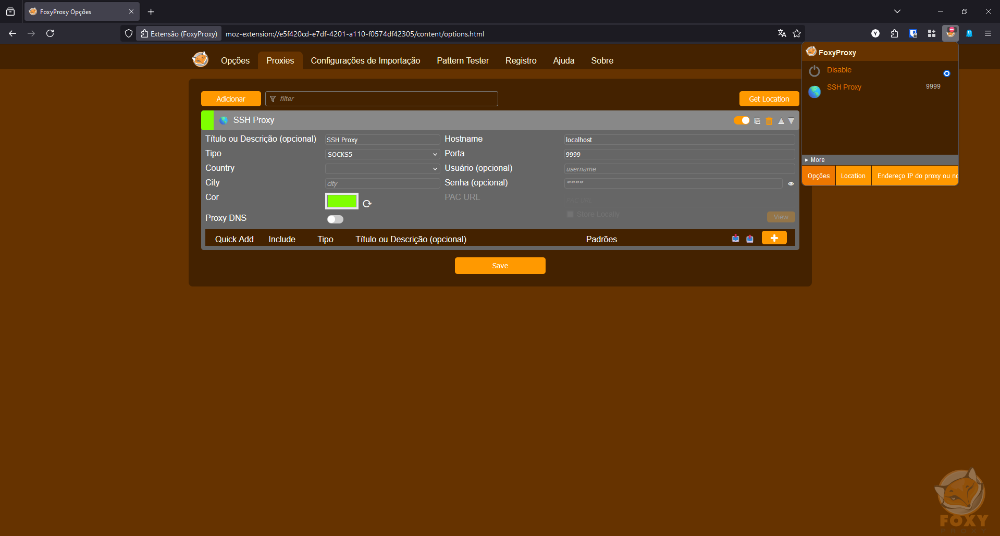
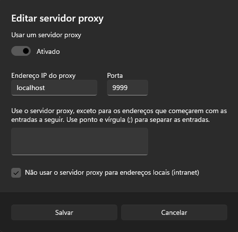

# Configurando um Túnel SSH com PuTTY e FoxyProxy no Windows 11
Este guia fornece instruções passo a passo para configurar um túnel SSH usando PuTTY no Windows 11 e configurar o FoxyProxy para redirecionar o tráfego da web pelo túnel SSH.

    

--- 
## Pré-requisitos
Antes de começar, certifique-se de ter os seguintes itens:

- Uma VM configurada na Oracle Cloud (ou outro serviço de hospedagem).
- Chave SSH privada (.ppk) configurada para acesso à VM.
- PuTTY instalado no seu Windows 11. [Download PuTTY](https://www.putty.org/).
- Extensão FoxyProxy instalada no seu navegador (Firefox ou Chrome).

---
## Passo 1: Converter a Chave SSH (Se necessário)
Caso sua chave SSH esteja em formato OpenSSH, você precisará convertê-la para o formato `.ppk` usado pelo PuTTY.

1. Abra o PuTTYgen.
2. Clique em Load e selecione sua chave privada.
3. Clique em Save private key para salvar a chave no formato .ppk.

## Passo 2: Configurar o PuTTY
1. Abra o PuTTY.
2. No campo Host Name (or IP address), insira o endereço IP público da sua VM.
3. No campo Port, insira 22.
4. Em Connection type, selecione SSH.

### Configurar o Túnel SSH
1. No menu à esquerda, expanda Connection > SSH > Tunnels.
2. Em Source port, insira 9999.
3. Selecione Dynamic e Auto.
4. Clique em Add.

5. No menu à esquerda, vá para Connection > SSH > Auth > Credentials e clique em Browse para selecionar sua chave privada .ppk.
6. Volte para o menu Session, dê um nome para sua sessão em Saved Sessions (por exemplo, OracleCloudSSH) e clique em Save.
7. Clique em Open para iniciar a conexão SSH.
8. Digite o nome de usuário da sua VM no prompt de comando que irá surgir (ubuntu para esta ocasião).

## Passo 3: Configurar o FoxyProxy
1. Abra o navegador e acesse as configurações do FoxyProxy.
2. Adicione um novo proxy com as seguintes configurações:
    - Nome: SSH Proxy
    - Tipo de Proxy: SOCKS5
    - Host: localhost
    - Porta: 9999
4. Salve a configuração e ative o proxy.

## Passo 4 (Em fase de testes): Configurar o Sistema para Usar o Túnel (Opcional)
Caso deseje que outros aplicativos, como o Steam, utilizem o túnel SSH, configure as definições de proxy no Windows:

1. Abra Configurações > Rede e Internet > Proxy.
2. Em Configuração manual de proxy, ative a opção e insira:
    - Endereço: localhost
    - Porta: 9999
3. Marque a caixa `Não usar o servidor proxy para endereços locais (intranet)`
4. Salve as alterações.

---
## Considerações Finais
Agora, você configurou com sucesso um túnel SSH usando PuTTY e redirecionou o tráfego do navegador via FoxyProxy. Não se esqueça de desativar o proxy e fechar a sessão PuTTY quando terminar.
